# ProClimber

ProClimber is the backend project for ProClimbersFE. The project is written in Python Django and utilizes the Python Rest framework. Here, all models can be viewed and manipulated.
Admins have full CRUD functionality but can also simulate not having admin rights. There are three types of users: Admins, who have full CRUD functionality, logged in customers who can create orders and reviews, and visitors, who can just read what is there.
All objects can manipulates manually in the restframework admin panel:

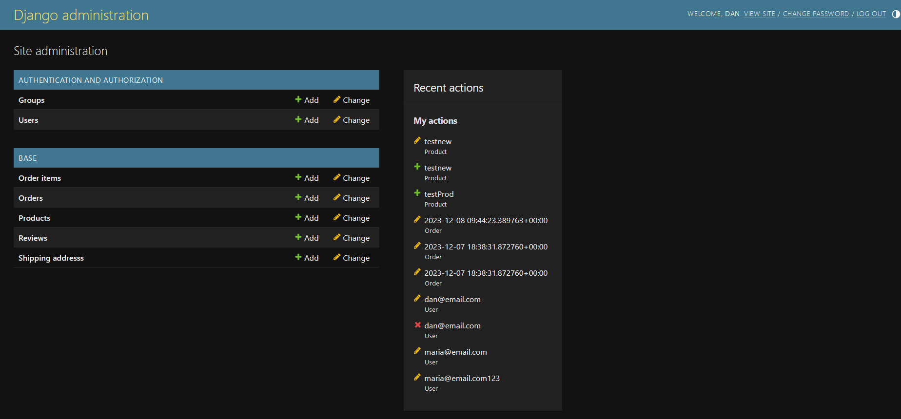

The Project can be seen [ProClimbers](https://proclimbers-backend-d69c858b50d1.herokuapp.com/)

## Features

### User

- The User Model is an imported Django default model. In the frontend, the username gets replaced with a mandatory user email. The model is connected to other child models through a foreign key.

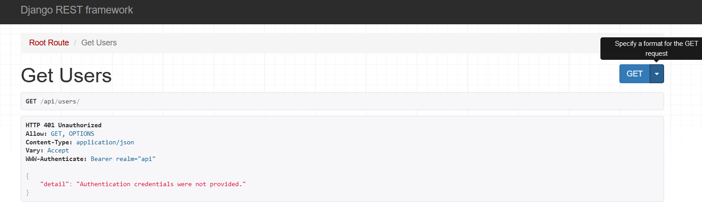

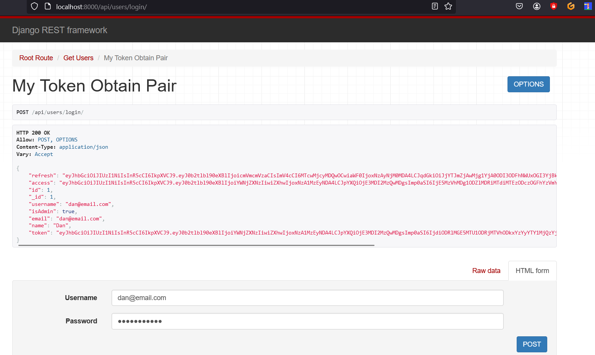

### Product

- The Product Model is the main model in this project. All attributes are optional since only shop owners or employees, who want to sell the products, have access to the CRUD functionality. It is not necessary to make attributes mandatory. Various attributes, like title, price, etc., can be assigned to them. The model is connected to other child models through a foreign key.

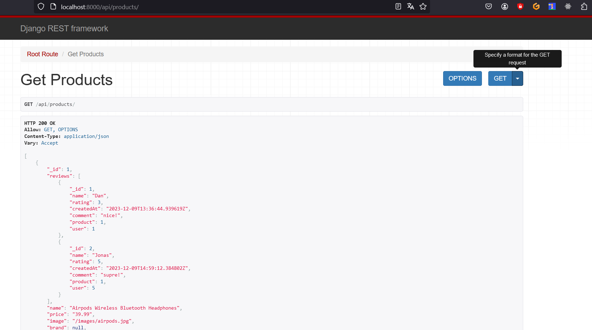
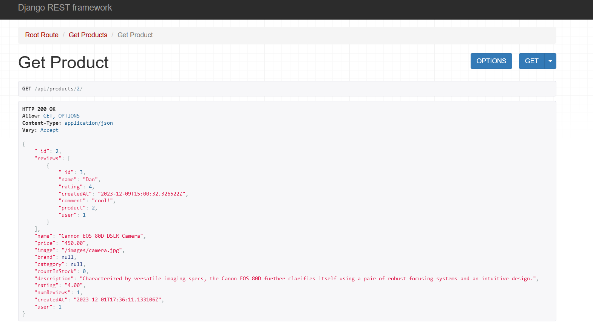

### Review

- The Review model is a direct child of the Product model. No attributes are mandatory. A logged in user can write a comment and give stars to vote for the product, motivating other customers to buy the product.
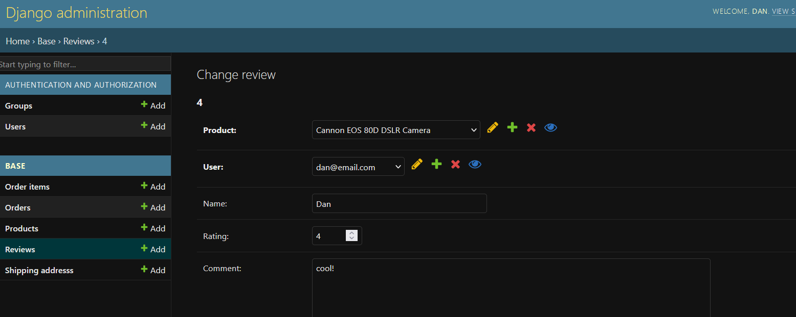

### Order

- A logged-in customer can create an order and go through the payment process. Here the user does not fill the mandatory attributes (except for the Payment method). The other attributes are set automatically. Only the delivery status can be set, but not by the creator, only by an admin. The model is a child model of the user model and direct parent model of the shipping model.
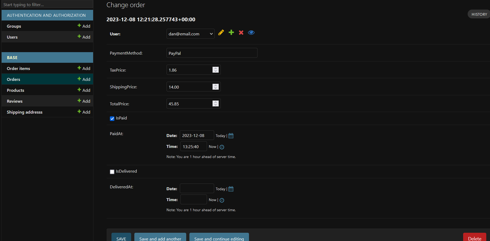

### Order Item

- This model is connected to an Order and to products. An Order can have several Items. During the ordering and payment process, the attributes get filled.
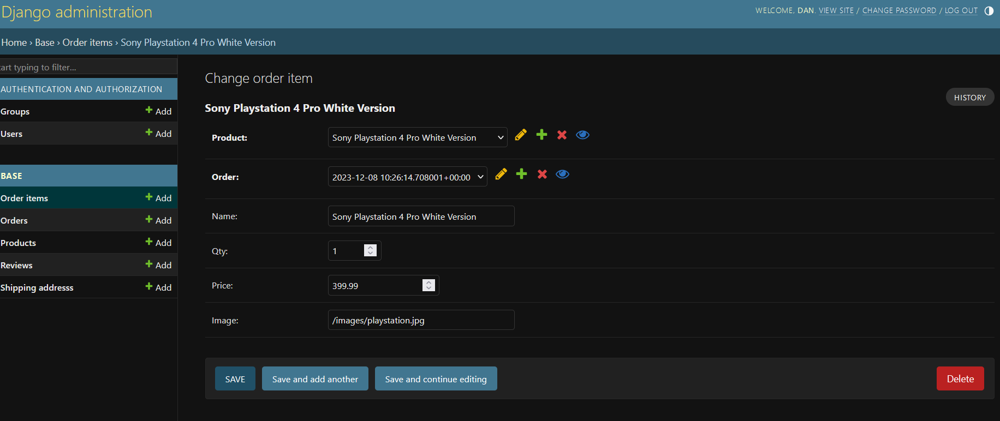

### Shipping

- During the order payment process, the user gets led through several pages. There the user has to fill all mandatory attributes (Address, Name, Amount, etc.) of the model.
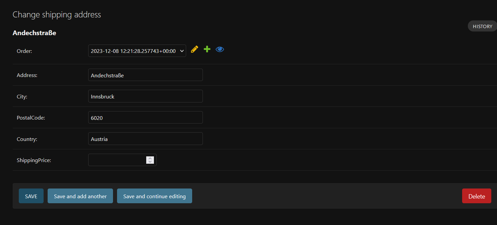

### 404
- If the user clicks a page which does not exist, the user comes to an options overview:
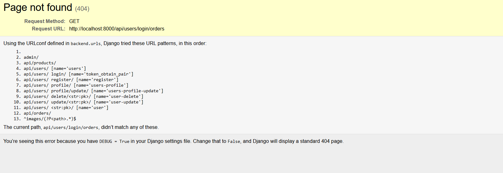

### Thought before creating the models:
- Before I started creating the models, I made a wireframe manually:
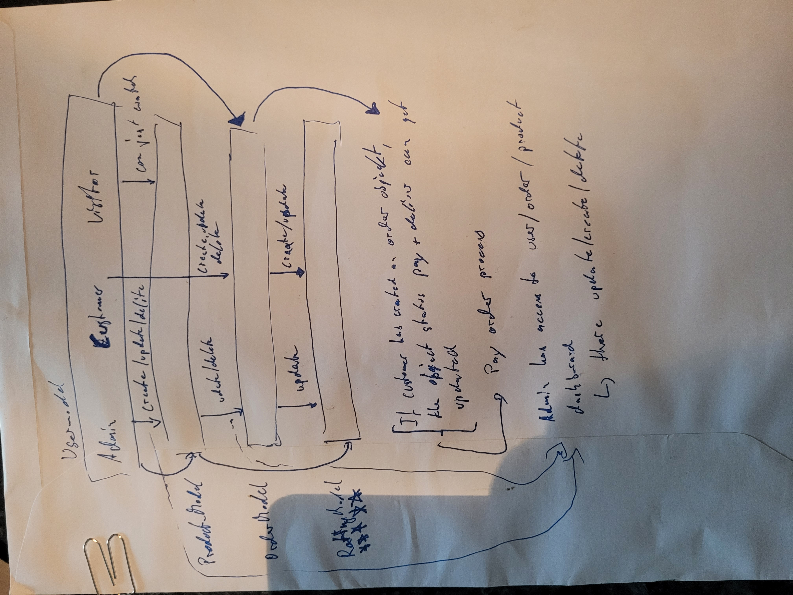

## Testing 

- I have manually tested the program in my local terminal by doing the following:
    - I have tested that the website works in different browsers (Chrome and Firefox).
    - I confirm that the website works and looks good on all standard screen sizes. This was tested with the devtools device toolbar.
    - I confirm that all forms are working.
    - I confirm that the user can create, edit, and delete properties and inquiries.
    - Passed the code through the Code Institute - PEP8 linter and confirmed that there are no problems.
    - Passt my API Urls in Postman to check tokens

Tested in the Code Institute Heroku terminal and in my local terminal.

### Validator Testing

  - CI Python PEP8 Linter 
     - No errors were detected when passing through the CI Python PEP8 Linter.
     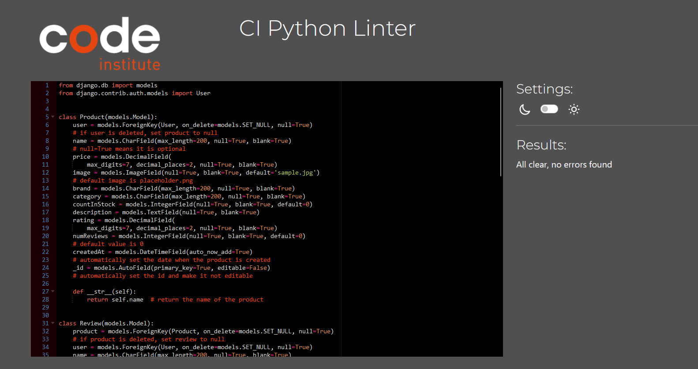

### API and token Testing
- [Postman](https://www.postman.com/)
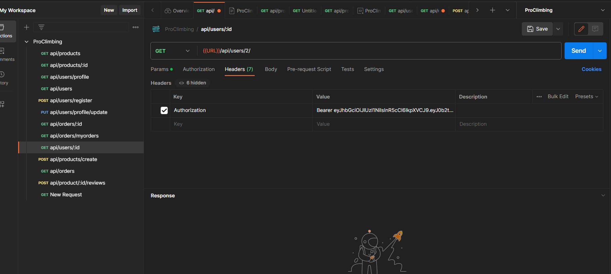

### Unfixed Bugs

 - All Bugs are fixed.

## Deployment

The project was deployed using Code Institute's mock for Heroku.

    Steps for deployment:
        This repository was cloned.
        A Heroku app was created.
        Added config vars for the secret key, for Cloudinary, and for the PostgreSQL database.
        The Heroku app was linked to the repository.
        Deploy was clicked.

## Credits 

### Content

- Instructions on how to structure backend projects, how to work with databases, how to use Django, PostgreSQL, and Cloudinary, are from [Code Institute - I think therefore I Blog](https://learn.codeinstitute.net/courses/course-v1:CodeInstitute+FST101+2021_T1/courseware/b31493372e764469823578613d11036b/fe4299adcd6743328183aab4e7ec5d13/) and
[Code Institute - Django Rest Framework](https://learn.codeinstitute.net/courses/course-v1:CodeInstitute+FST101+2021_T1/courseware/dc049b343a9b474f8d75822c5fda1582/a706dbb65b2d467a84e1bf67266851b1/)
- Instructions on how to use postman were taken from [Youtube](https://www.youtube.com/watch?v=cGn_LTFCif0)

### Personal Advice

  - Thank You!
    -  Jubril Akolade
    - All people from my Slack Group!